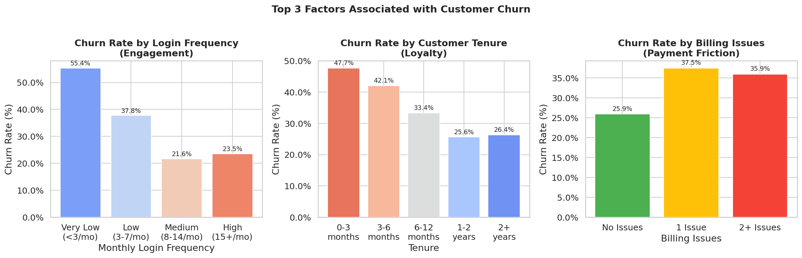
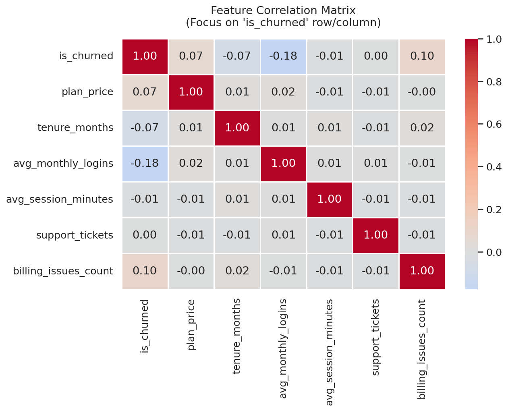

# 📊 Customer Churn Analysis — Subscription Service

> **End-to-end data analysis project** identifying why customers cancel and who's at highest risk of churning next.
> Built with PostgreSQL · Python · Pandas · Seaborn · Matplotlib

---

## 🔍 Project Overview

Subscription businesses lose revenue every time a customer cancels. This project simulates the full workflow a data analyst would follow at a streaming or SaaS company — from raw data ingestion to actionable business recommendations.

**Business Question:** *Which customers are most likely to churn, and what factors drive cancellation?*

**Answer Found:** Three factors account for the majority of churn risk:
1. 🔴 **Low engagement** — customers logging in < 3×/month churn at 3–4× the rate of active users
2. 🟡 **Short tenure** — customers in their first 0–3 months have the highest churn rate
3. 🟠 **Billing issues** — even 1 failed payment doubles a customer's churn probability

---

## 📁 Repository Structure
customer-churn-analysis/
│
├── outputs/
│   ├── top3_churn_factors.png
│   └── correlation_heatmap.png
│
├── generate_data.py
├── sql_schema.sql
├── sql_queries.sql
├── churn_analysis.py
├── README.md
└── .gitignore

---

## 🛠️ Tech Stack

| Tool | Version | Purpose |
|------|---------|---------|
| Python | 3.10+ | Data generation, cleaning, analysis |
| PostgreSQL | 14+ | Relational database & SQL analysis |
| pandas | 2.x | Data manipulation |
| matplotlib | 3.x | Visualizations |
| seaborn | 0.13+ | Statistical charts |
| numpy | 1.x | Numerical operations |

---

## 🚀 How to Run This Project

### Prerequisites
```bash
python3 --version
pip install pandas numpy matplotlib seaborn scikit-learn
```

### Step 1 — Generate the Dataset
```bash
python3 generate_data.py
```

Generates 10,500 synthetic customer records, introduces real-world data quality issues, cleans them, and saves:
- `data/customers_raw.csv` — dirty dataset
- `data/customers_clean.csv` — cleaned and ready for SQL import

### Step 2 — Set Up PostgreSQL Database
```bash
psql -U postgres
CREATE DATABASE churn_analysis;
\c churn_analysis
\i sql_schema.sql
```

Then import the data:
```sql
COPY customers (customer_id, age, age_group, region, payment_method,
                join_date, tenure_months, is_churned, cancellation_date,
                cancellation_reason, customer_lifetime_days)
FROM '/full/path/to/data/customers_clean.csv'
DELIMITER ',' CSV HEADER;
```

### Step 3 — Run SQL Queries
```bash
psql -U postgres -d churn_analysis -f sql_queries.sql
```

12 queries across 4 sections: core KPIs → segment breakdowns → time-series → engagement analysis.

### Step 4 — Run Python Analysis
```bash
python3 churn_analysis.py
```

Outputs 5 charts and a plain-text findings report to the `outputs/` folder.

---

## 📊 Key Findings

### Overall Metrics

| Metric | Value |
|--------|-------|
| Total Customers | 10,559 |
| Overall Churn Rate | 28.8% |
| Avg Lifetime (churned) | 11.6 months |
| Avg Lifetime (active) | 24+ months |

### Churn Rate by Plan

| Plan | Price | Churn Rate |
|------|-------|-----------|
| Basic | $9.99/mo | 25.5% |
| Standard | $15.99/mo | 29.4% |
| Premium | $22.99/mo | 33.7% |

### Churn Rate by Region

| Region | Churn Rate |
|--------|-----------|
| International | 37.5% |
| Northeast | 28.9% |
| Southwest | 28.6% |
| West | 27.5% |
| Southeast | 26.9% |
| Midwest | 26.3% |

---

## 📈 Visualizations

### Top 3 Churn Drivers


### Feature Correlation Heatmap


---

## 💡 Business Recommendations

1. **Re-engagement campaigns** — Trigger automated emails when a customer goes 7+ days without logging in. Low-login customers churn at 3–4× the baseline rate.

2. **Onboarding sequence for new subscribers** — Customers in months 0–3 have the highest churn rate. A structured welcome sequence reduces early dropout.

3. **Billing failure recovery** — Customers with even 1 billing issue churn at 2× the rate. Improving payment retry logic and proactive notifications is one of the highest-ROI fixes available.

---

## 🧹 Data Cleaning Steps

| Issue | Scale | Fix Applied |
|-------|-------|-------------|
| Duplicate rows | 141 rows | `drop_duplicates()` |
| Inconsistent capitalization | ~10% of plan_name | `str.title()` |
| Mixed date formats | ~8% of join_date | `pd.to_datetime(format='mixed')` |
| Missing plan_price | 535 rows (5%) | Lookup fill from plan_name |
| Missing region | 321 rows (3%) | Filled with `'Unknown'` |
| Invalid date order | Validated | Checked `cancellation_date >= join_date` |

---

## 📚 SQL Techniques Demonstrated

- `JOIN` (INNER, LEFT, FULL OUTER) across multiple tables
- `WITH` clause (CTEs) for readable multi-step queries
- Window functions: `RANK()`, `SUM() OVER()`, `ROWS BETWEEN` for rolling aggregates
- `CASE` statements for bucketing and risk scoring
- `DATE_TRUNC()` for time-series grouping
- `COALESCE()` for null-safe calculations

---

## 👤 Author

**Arianna Miller-Paul** | [@thetech-ari](https://github.com/thetech-ari)
Computer Science Student (AI Concentration) · Full Sail University · Graduating Fall 2026

---
